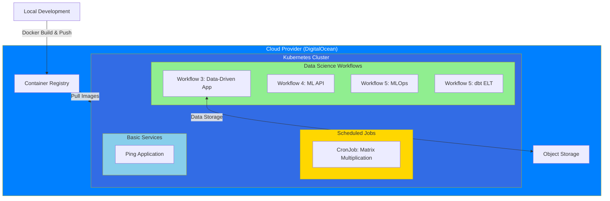
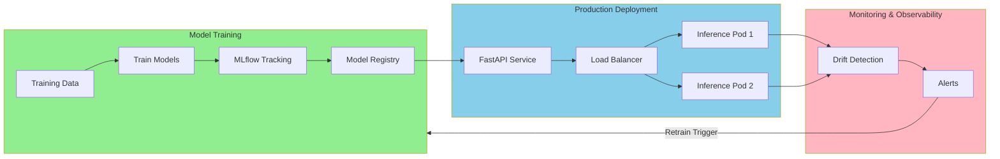

# Mawingu Experiments

A comprehensive collection of Kubernetes and Docker examples demonstrating modern data science, machine learning, and MLOps workflows deployable to cloud providers. This repository showcases practical implementations of containerized applications, from basic Flask services to production-grade MLOps pipelines with experiment tracking, model deployment, and monitoring.

## Key Features

- **Production MLOps Pipeline**: Complete ML lifecycle with MLflow, FastAPI, monitoring, and A/B testing
- **Modern ELT Pipeline**: dbt-based data transformations with DuckDB and Dagster orchestration
- **Data-Driven Applications**: Real-time data generation and visualization with cloud storage integration
- **ML Prediction APIs**: RESTful APIs for model inference deployed on Kubernetes
- **Kubernetes Scheduling**: CronJob examples for scheduled workloads
- **Cloud-Ready**: Full deployment guides for DigitalOcean Kubernetes
- **Docker Optimization**: Containerized applications with size optimization strategies

## Table of Contents

- [Architecture](#architecture)
- [Project Structure](#project-structure)
- [Getting Started](#getting-started)
  - [Prerequisites](#prerequisites)
  - [Quick Start](#quick-start)
  - [Installation](#installation)
- [Workflows](#workflows)
  - [Workflow 3: Data-Driven Application](#workflow-3-data-driven-application)
  - [Workflow 4: ML Prediction API](#workflow-4-ml-prediction-api)
  - [Workflow 5: MLOps Deployment](#workflow-5-mlops-deployment)
  - [Workflow 5: dbt ELT Pipeline](#workflow-5-dbt-elt-pipeline)
  - [Kubernetes Scheduling](#kubernetes-scheduling)
  - [Ping Application](#ping-application)
- [Cloud Deployment](#cloud-deployment)
- [Environment Variables](#environment-variables)
- [Testing](#testing)
- [Troubleshooting](#troubleshooting)
- [Contributing](#contributing)
- [Use Cases](#use-cases)
- [License](#license)
- [Credits & Attribution](#credits--attribution)

## Architecture

### High-Level System Architecture

This repository demonstrates a microservices architecture where each workflow operates as an independent containerized service deployable to Kubernetes:



### MLOps Deployment Flow

The MLOps workflow demonstrates a complete production ML pipeline:



## Project Structure

```
mawingu-experiments/
├── data-science-workflows/          # Data science and ML workflows
│   ├── README.md                    # Overview of data science workflows
│   ├── workflow3-data-driven-app/   # Real-time data generation & plotting
│   │   ├── dataloader/              # Data generation service
│   │   │   ├── deployments.yaml     # Kubernetes manifest
│   │   │   ├── Dockerfile           # Container definition
│   │   │   ├── main.py              # Data generation script
│   │   │   ├── Makefile             # Build automation
│   │   │   ├── mylib/               # Data loader library
│   │   │   ├── Pipfile              # Python dependencies
│   │   │   └── test_main.py         # Unit tests
│   │   ├── timeseries_plot/         # Time series visualization service
│   │   │   ├── deployments.yaml     # Kubernetes manifest
│   │   │   ├── Dockerfile           # Container definition
│   │   │   ├── plot_timeseries.py   # Plotting script with SQLite
│   │   │   ├── mylib/               # Data processing library
│   │   │   └── Pipfile              # Python dependencies
│   │   └── README.md                # Detailed workflow documentation
│   │
│   ├── workflow4-data-science-api/  # ML inference API
│   │   ├── app.py                   # Flask API application
│   │   ├── deployments.yml          # Kubernetes manifest
│   │   ├── Dockerfile               # Container definition
│   │   ├── iris_knn_model.pkl       # Pre-trained model
│   │   ├── requirements.txt         # Python dependencies
│   │   ├── service.yaml             # Kubernetes service
│   │   └── README.md                # API documentation
│   │
│   ├── workflow5-mlops-deployment/  # Production MLOps pipeline
│   │   ├── training/                # Model training scripts
│   │   │   └── train_model.py       # MLflow-based training
│   │   ├── inference/               # FastAPI inference service
│   │   │   └── app.py               # API with health checks
│   │   ├── monitoring/              # Drift detection
│   │   │   └── monitor.py           # Evidently monitoring
│   │   ├── Dockerfile.training      # Training container
│   │   ├── Dockerfile.inference     # Inference container
│   │   ├── docker-compose.yml       # Multi-service orchestration
│   │   ├── k8s-deployment.yaml      # Kubernetes manifests
│   │   ├── requirements.txt         # Python dependencies
│   │   └── README.md                # Complete MLOps guide
│   │
│   └── workflow5-dbt-elt-pipeline/  # Modern ELT pipeline
│       ├── dbt_project/             # dbt transformations
│       │   ├── models/              # Staging, intermediate, marts
│       │   ├── tests/               # Data quality tests
│       │   └── macros/              # Reusable SQL
│       ├── orchestrator/            # Dagster orchestration
│       ├── scripts/                 # ETL scripts
│       ├── data/                    # Sample datasets
│       ├── Dockerfile               # Container definition
│       ├── deployments.yaml         # Kubernetes manifest
│       └── README.md                # ELT pipeline guide
│
├── kubernetes-scheduling/           # CronJob scheduling example
│   ├── deployments.yaml             # CronJob manifest (every 5 minutes)
│   ├── Dockerfile                   # Container definition
│   ├── matmulsched.py               # Matrix multiplication job
│   ├── Pipfile                      # Python dependencies
│   └── README.md                    # Scheduling documentation
│
├── ping-app/                        # Basic Flask service
│   ├── deployments.yaml             # Kubernetes deployment
│   ├── Dockerfile                   # Container definition
│   ├── ping.py                      # Flask application
│   ├── Pipfile                      # Python dependencies
│   └── service.yaml                 # Kubernetes service (external access)
│
├── getting-stuff-to-cloud.md        # DigitalOcean deployment guide
├── LICENSE                          # CC0-1.0 Universal license
└── README.md                        # This file
```

## Getting Started

### Prerequisites

**Required:**
- **Docker** (v20.10+): Container runtime for building and running images
- **kubectl** (v1.22+): Kubernetes command-line tool
- **Python** (3.8+): For local development and testing
- **Git**: Version control

**Optional:**
- **doctl**: DigitalOcean CLI for cluster management
- **Docker Compose**: Multi-container orchestration
- **Pipenv**: Python dependency management
- **MLflow**: Experiment tracking (for Workflow 5)
- **dbt**: Data transformation tool (for dbt ELT pipeline)

**Cloud Provider:**
- DigitalOcean account (or alternative Kubernetes provider)
- Container registry access
- Object storage (DigitalOcean Spaces or S3-compatible)

### Quick Start

```bash
# Clone the repository
git clone https://github.com/Shuyib/mawingu-experiments.git
cd mawingu-experiments

# Choose a workflow to explore
cd data-science-workflows/workflow4-data-science-api

# Build Docker image
docker build -t ml-api:v1 .

# Run locally
docker run -p 5000:5000 ml-api:v1

# Test the API
curl http://localhost:5000/predict
```

### Installation

#### 1. Install Docker

**Linux:**
```bash
curl -fsSL https://get.docker.com -o get-docker.sh
sudo sh get-docker.sh
sudo usermod -aG docker $USER
```

**macOS/Windows:**
Download and install [Docker Desktop](https://www.docker.com/products/docker-desktop)

#### 2. Install kubectl

```bash
# Linux
curl -LO "https://dl.k8s.io/release/$(curl -L -s https://dl.k8s.io/release/stable.txt)/bin/linux/amd64/kubectl"
chmod +x kubectl
sudo mv kubectl /usr/local/bin/

# macOS
brew install kubectl

# Windows
choco install kubernetes-cli
```

#### 3. Install Python Dependencies

```bash
# Using pip
pip install -r requirements.txt

# Using pipenv (recommended)
pip install pipenv
cd <workflow-directory>
pipenv install
pipenv shell
```

#### 4. Install DigitalOcean CLI (Optional)

```bash
# Linux/macOS
cd ~
wget https://github.com/digitalocean/doctl/releases/download/v1.92.0/doctl-1.92.0-linux-amd64.tar.gz
tar xf ~/doctl-1.92.0-linux-amd64.tar.gz
sudo mv ~/doctl /usr/local/bin

# Authenticate
doctl auth init
```

## Workflows

### Workflow 3: Data-Driven Application

**Purpose**: Demonstrates real-time data generation and visualization with cloud storage integration using SQLite for data persistence.

**Architecture Components:**
- **Data Loader**: Generates time-series data and uploads to S3-compatible object storage
- **Time Series Plotter**: Downloads data from storage, stores in SQLite, generates plots, and uploads visualizations
- **Object Storage**: DigitalOcean Spaces (S3-compatible) for data exchange

**Key Features:**
- Incremental data loading with duplicate detection
- SQLite database for historical data persistence
- Automated plot generation and storage
- Kubernetes deployment with separate pods for each service

**Getting Started:**

```bash
cd data-science-workflows/workflow3-data-driven-app

# Set up environment variables
export ENDPOINT_URL=https://ams3.digitaloceanspaces.com
export SECRET_KEY=your_secret_key
export SPACES_ID=your_spaces_id
export SPACES_NAME=your_spaces_name

# Build data loader
cd dataloader
docker build -t dataloader:v1 .
docker run -e ENDPOINT_URL -e SECRET_KEY -e SPACES_ID -e SPACES_NAME dataloader:v1

# Build time series plotter
cd ../timeseries_plot
docker build -t plot-timeseries:v1 .
docker run -e ENDPOINT_URL -e SECRET_KEY -e SPACES_ID -e SPACES_NAME plot-timeseries:v1
```

**Kubernetes Deployment:**

```bash
# Deploy data loader
kubectl apply -f dataloader/deployments.yaml

# Deploy plotter
kubectl apply -f timeseries_plot/deployments.yaml

# Check pod status
kubectl get pods
kubectl logs <pod-name>
```

**Documentation**: [Workflow 3 README](data-science-workflows/workflow3-data-driven-app/README.md)

### Workflow 4: ML Prediction API

**Purpose**: Exposes a machine learning model (Iris classification) as a REST API for real-time predictions.

**Architecture Components:**
- **Flask API**: REST endpoint for model inference
- **Pre-trained Model**: K-Nearest Neighbors classifier (pickle format)
- **Kubernetes Service**: Load balancer for external access

**Use Cases:**
- Computer vision applications
- Natural language processing inference
- Generative model APIs
- Real-time prediction services

**Getting Started:**

```bash
cd data-science-workflows/workflow4-data-science-api

# Build Docker image
docker build -t iris-api:v1 .

# Run locally
docker run -p 5000:5000 iris-api:v1

# Test prediction
curl -X POST http://localhost:5000/predict \
  -H "Content-Type: application/json" \
  -d '{"sepal_length": 5.1, "sepal_width": 3.5, "petal_length": 1.4, "petal_width": 0.2}'
```

**Kubernetes Deployment:**

```bash
# Deploy API
kubectl apply -f deployments.yml

# Expose service
kubectl apply -f service.yaml

# Get external IP
kubectl get service iris-api-service
```

**Documentation**: [Workflow 4 README](data-science-workflows/workflow4-data-science-api/README.md)

### Workflow 5: MLOps Deployment

**Purpose**: Production-grade ML deployment pipeline with experiment tracking, model registry, deployment, monitoring, and A/B testing.

**Architecture Components:**
- **MLflow**: Experiment tracking and model registry
- **FastAPI**: High-performance inference service
- **Evidently**: Data drift detection and monitoring
- **Docker Compose**: Local multi-service orchestration
- **Kubernetes**: Production deployment with auto-scaling

**Key Features:**
- Model versioning and lifecycle management
- Real-time and batch predictions
- A/B testing with traffic splitting
- Performance monitoring and alerting
- Horizontal pod autoscaling
- Health checks and observability

**Getting Started:**

```bash
cd data-science-workflows/workflow5-mlops-deployment

# Install dependencies
pip install -r requirements.txt

# Train models with MLflow
python training/train_model.py --model-type both

# View experiments
mlflow ui --backend-store-uri file:./mlruns
# Open http://localhost:5000

# Run inference service
python inference/app.py

# Test API
curl -X POST http://localhost:8000/predict \
  -H "Content-Type: application/json" \
  -d '{
    "features": {
      "alcohol": 13.5,
      "malic_acid": 2.3,
      "ash": 2.4,
      "alcalinity_of_ash": 19.0,
      "magnesium": 100.0,
      "total_phenols": 2.8,
      "flavanoids": 2.6,
      "nonflavanoid_phenols": 0.3,
      "proanthocyanins": 1.9,
      "color_intensity": 5.5,
      "hue": 1.0,
      "od280_od315_of_diluted_wines": 3.1,
      "proline": 1000.0
    }
  }'
```

**Docker Compose Deployment:**

```bash
# Start all services
docker-compose up --build

# Services available:
# - MLflow UI: http://localhost:5000
# - Inference API (Random Forest): http://localhost:8001
# - Inference API (XGBoost): http://localhost:8002
```

**Kubernetes Deployment:**

```bash
# Deploy full stack
kubectl apply -f k8s-deployment.yaml

# Check deployments
kubectl get deployments
kubectl get pods
kubectl get hpa

# Port forward services
kubectl port-forward service/mlflow-service 5000:5000
kubectl port-forward service/inference-service 8000:80
```

**Documentation**: [Workflow 5 MLOps README](data-science-workflows/workflow5-mlops-deployment/README.md)

### Workflow 5: dbt ELT Pipeline

**Purpose**: Modern data engineering pipeline using dbt for transformations, DuckDB as the data warehouse, and Dagster for orchestration.

**Architecture Components:**
- **dbt**: SQL-based transformations with testing
- **DuckDB**: Embedded analytical database
- **Dagster**: Asset-based orchestration
- **Python**: ETL scripts and automation

**Pipeline Layers:**
1. **Staging**: Raw data ingestion with minimal transformations
2. **Intermediate**: Business logic and data cleaning
3. **Mart**: Aggregated, analysis-ready datasets

**Key Features:**
- Modular SQL transformations
- Built-in data quality testing
- Version-controlled analytics code
- Incremental model updates
- Self-documenting pipeline

**Getting Started:**

```bash
cd data-science-workflows/workflow5-dbt-elt-pipeline

# Install dependencies
pip install -r requirements.txt

# Load sample data
python scripts/load_sample_data.py

# Run dbt models
cd dbt_project
dbt deps
dbt run
dbt test

# Generate documentation
dbt docs generate
dbt docs serve
# Open http://localhost:8080

# Run with Dagster orchestration
dagster dev -f orchestrator/dagster_pipeline.py
# Open http://localhost:3000
```

**Kubernetes Deployment:**

```bash
# Deploy pipeline
kubectl apply -f deployments.yaml

# Check logs
kubectl logs -f <pod-name>
```

**Documentation**: [Workflow 5 dbt ELT README](data-science-workflows/workflow5-dbt-elt-pipeline/README.md)

### Kubernetes Scheduling

**Purpose**: Demonstrates Kubernetes CronJob scheduling with a matrix multiplication example that runs every 5 minutes.

**Architecture Components:**
- **CronJob**: Kubernetes scheduled job
- **NumPy**: Matrix operations
- **Timestamping**: Job execution tracking

**Use Cases:**
- Scheduled data processing
- Periodic model training
- Batch ETL jobs
- Automated reporting

**Getting Started:**

```bash
cd kubernetes-scheduling

# Build Docker image
docker build -t matmul-cronjob:v1 .

# Test locally
docker run -e TZ="Africa/Nairobi" -it --rm matmul-cronjob:v1

# Generate deployment manifest
kubectl create cronjob matmulsched \
  --image=matmul-cronjob:v1 \
  --schedule="*/5 * * * *" \
  --dry-run=client -o yaml > deployments.yaml

# Deploy to Kubernetes
kubectl apply -f deployments.yaml

# Monitor execution
kubectl get cronjobs
kubectl get pods --watch
kubectl logs <pod-name>
```

**Expected Output:**

```
Starting dot product operation at: 2022-04-10 10:35:10.925554
Doing the operation.....
[[3.13924564 3.13924564]
 [0.93624891 0.93624891]]
Stopping job: 2022-04-10 10:35:40.952996
```

**Documentation**: [Kubernetes Scheduling README](kubernetes-scheduling/README.md)

### Ping Application

**Purpose**: Basic Flask application demonstrating simple HTTP service deployment on Kubernetes with external access.

**Architecture Components:**
- **Flask**: Lightweight web framework
- **Kubernetes Deployment**: Application pods
- **Kubernetes Service**: Load balancer for external access

**Getting Started:**

```bash
cd ping-app

# Build Docker image
docker build -t ping-app:v1 .

# Test locally
docker run -it --rm -p 9696:9696 ping-app:v1

# Test endpoint
curl http://localhost:9696/ping
# Response: PONG

# Deploy to Kubernetes
kubectl apply -f deployments.yaml
kubectl apply -f service.yaml

# Get external IP
kubectl get service ping-service

# Test on Kubernetes
curl http://<external-ip>/ping
```

## Cloud Deployment

### DigitalOcean Kubernetes Setup

#### 1. Create Kubernetes Cluster

```bash
# Install doctl
doctl auth init

# Create cluster
doctl kubernetes cluster create mawingu-cluster \
  --version 1.28.2-do.0 \
  --count 2 \
  --size s-2vcpu-4gb \
  --region lon1

# Get kubeconfig
doctl kubernetes cluster kubeconfig save mawingu-cluster

# Verify connection
kubectl get nodes
```

#### 2. Set Up Container Registry

```bash
# Create registry
doctl registry create mawingu-registry

# Authenticate Docker
doctl registry login

# Tag and push image
docker tag my-app:v1 registry.digitalocean.com/mawingu-registry/my-app:v1
docker push registry.digitalocean.com/mawingu-registry/my-app:v1

# Connect registry to cluster (via DigitalOcean Console)
# Settings → Container Registry → Integration → Select Cluster
```

#### 3. Deploy Application

```bash
# Update deployment manifest with registry path
# image: registry.digitalocean.com/mawingu-registry/my-app:v1

# Apply manifest
kubectl apply -f deployments.yaml
kubectl apply -f service.yaml

# Monitor deployment
kubectl get deployments
kubectl get pods
kubectl get services
```

#### 4. Cost Optimization

**Cluster Sizing:**
- Start with smaller node pools (s-2vcpu-4gb)
- Use autoscaling for variable workloads
- Scale down non-production environments

**Container Optimization:**
- Use multi-stage Docker builds
- Minimize image layers
- Use slim base images (alpine, distroless)
- Consider Docker Slim for image reduction

**Resource Limits:**
```yaml
resources:
  requests:
    memory: "256Mi"
    cpu: "250m"
  limits:
    memory: "512Mi"
    cpu: "500m"
```

**Clean Up:**
```bash
# Delete cluster when not in use
doctl kubernetes cluster delete mawingu-cluster

# Delete unused images
doctl registry garbage-collection start --include-untagged-manifests
```

**Detailed Guide**: [getting-stuff-to-cloud.md](getting-stuff-to-cloud.md)

## Environment Variables

### Workflow 3: Data-Driven Application

**Required:**
```bash
export ENDPOINT_URL=https://ams3.digitaloceanspaces.com  # Object storage endpoint
export SECRET_KEY=your_secret_key                          # S3 secret key
export SPACES_ID=your_spaces_id                            # S3 access key ID
export SPACES_NAME=your_spaces_name                        # Bucket/space name
```

### Workflow 5: MLOps Deployment

**Optional:**
```bash
export MLFLOW_TRACKING_URI=http://localhost:5000           # MLflow server
export MODEL_VERSION=random_forest                         # Model to use
export INFERENCE_TIMEOUT=30                                # API timeout
```

### Kubernetes Scheduling

**Optional:**
```bash
export TZ=Africa/Nairobi                                   # Timezone for logs
```

### Example .env File

```bash
# Object Storage Configuration
ENDPOINT_URL=https://ams3.digitaloceanspaces.com
SECRET_KEY=your_digitalocean_secret_key
SPACES_ID=your_digitalocean_spaces_id
SPACES_NAME=your_bucket_name

# MLflow Configuration
MLFLOW_TRACKING_URI=http://localhost:5000
MLFLOW_EXPERIMENT_NAME=wine_classification

# API Configuration
API_HOST=0.0.0.0
API_PORT=8000
MODEL_VERSION=random_forest

# Timezone
TZ=Africa/Nairobi
```

## Testing

### Workflow 3: Data-Driven Application

```bash
cd data-science-workflows/workflow3-data-driven-app/dataloader

# Install dependencies
pipenv install --dev

# Run tests
pipenv shell
python -m pytest test_main.py -v

# Check data generation
python main.py
```

### Workflow 4: ML Prediction API

```bash
cd data-science-workflows/workflow4-data-science-api

# Run API locally
python app.py

# Test endpoint (in another terminal)
curl -X POST http://localhost:5000/predict \
  -H "Content-Type: application/json" \
  -d '{"sepal_length": 5.1, "sepal_width": 3.5, "petal_length": 1.4, "petal_width": 0.2}'
```

### Workflow 5: MLOps Deployment

```bash
cd data-science-workflows/workflow5-mlops-deployment

# Run model training tests
python training/train_model.py --model-type sklearn

# Test inference API
python -m pytest tests/ -v

# Test monitoring
python monitoring/monitor.py
```

### Workflow 5: dbt ELT Pipeline

```bash
cd data-science-workflows/workflow5-dbt-elt-pipeline/dbt_project

# Run data quality tests
dbt test

# Test specific model
dbt test --select stg_customers

# Test for uniqueness
dbt test --select test_type:unique
```

### Kubernetes Deployment Tests

```bash
# Check pod status
kubectl get pods

# View logs
kubectl logs <pod-name>

# Exec into container
kubectl exec -it <pod-name> -- /bin/bash

# Test service connectivity
kubectl port-forward service/my-service 8080:80
curl http://localhost:8080/health
```

## Troubleshooting

### Docker Issues

**Problem: Image build fails**
```bash
# Clear Docker cache
docker builder prune -a

# Rebuild without cache
docker build --no-cache -t my-app:v1 .

# Check Docker daemon
sudo systemctl status docker
sudo systemctl restart docker
```

**Problem: Container exits immediately**
```bash
# View container logs
docker logs <container-id>

# Run interactively
docker run -it my-app:v1 /bin/bash

# Check entry point
docker inspect my-app:v1 | grep -A 5 "Entrypoint"
```

**Problem: Permission denied**
```bash
# Add user to docker group
sudo usermod -aG docker $USER
newgrp docker

# Fix socket permissions
sudo chmod 666 /var/run/docker.sock
```

### Kubernetes Issues

**Problem: ImagePullBackOff**
```bash
# Check image exists
docker images | grep my-app

# Verify registry authentication
kubectl get secrets
kubectl describe pod <pod-name>

# Create registry secret
kubectl create secret docker-registry regcred \
  --docker-server=registry.digitalocean.com \
  --docker-username=<username> \
  --docker-password=<password>
```

**Problem: CrashLoopBackOff**
```bash
# View pod logs
kubectl logs <pod-name>
kubectl logs <pod-name> --previous

# Describe pod for events
kubectl describe pod <pod-name>

# Check resource limits
kubectl top pods
```

**Problem: Service not accessible**
```bash
# Check service status
kubectl get services
kubectl describe service <service-name>

# Verify endpoints
kubectl get endpoints <service-name>

# Test internal connectivity
kubectl run test-pod --image=busybox -it --rm -- wget -qO- http://<service-name>
```

### MLflow Issues

**Problem: MLflow UI not accessible**
```bash
# Check MLflow server is running
ps aux | grep mlflow

# Start MLflow UI
mlflow ui --backend-store-uri file:./mlruns --host 0.0.0.0 --port 5000

# Set tracking URI
export MLFLOW_TRACKING_URI=http://localhost:5000
```

**Problem: Model loading errors**
```bash
# Verify model exists
ls -la models/
mlflow models list

# Check model registry
mlflow models list --registered-model-name wine_classifier_rf

# Test model loading
python -c "import mlflow; model = mlflow.sklearn.load_model('models/my_model'); print(model)"
```

**Problem: Experiment tracking errors**
```bash
# Check MLflow tracking directory
ls -la mlruns/

# Reset experiment
rm -rf mlruns/
mlflow ui --backend-store-uri file:./mlruns

# Check permissions
chmod -R 755 mlruns/
```

### Object Storage Issues

**Problem: S3 connection errors**
```bash
# Test connectivity
curl -I https://ams3.digitaloceanspaces.com

# Verify credentials
aws s3 ls --endpoint-url=https://ams3.digitaloceanspaces.com

# Check environment variables
echo $ENDPOINT_URL
echo $SPACES_ID
echo $SPACES_NAME
```

## Contributing

We welcome contributions to improve and extend the examples in this repository.

### How to Contribute

1. **Fork the repository**
   ```bash
   git clone https://github.com/Shuyib/mawingu-experiments.git
   cd mawingu-experiments
   git checkout -b feature/my-new-workflow
   ```

2. **Make your changes**
   - Add new workflows or improve existing ones
   - Update documentation
   - Fix bugs or improve performance
   - Add tests for new functionality

3. **Test your changes**
   - Build and test Docker images locally
   - Verify Kubernetes deployments work
   - Run existing tests
   - Add new tests for your changes

4. **Commit and push**
   ```bash
   git add .
   git commit -m "Add: description of your changes"
   git push origin feature/my-new-workflow
   ```

5. **Create a Pull Request**
   - Provide clear description of changes
   - Reference any related issues
   - Include screenshots for UI changes

### Code Style Requirements

**Python:**
- Follow PEP 8 style guide
- Use type hints where appropriate
- Add docstrings for functions and classes
- Use meaningful variable names

**Docker:**
- Use multi-stage builds when possible
- Minimize layers
- Add comments for complex operations
- Pin dependency versions

**Kubernetes:**
- Use meaningful resource names
- Add labels for organization
- Include resource limits
- Document required environment variables

**Documentation:**
- Update relevant README files
- Add code examples
- Include troubleshooting tips
- Keep formatting consistent

### Pull Request Process

1. Ensure all tests pass
2. Update documentation for any new features
3. Follow the existing code style
4. Add yourself to credits if significant contribution
5. Wait for review and address feedback

## Use Cases

### Data Engineering
- **Real-time Data Pipelines**: Use Workflow 3 for continuous data generation and processing
- **ELT Workflows**: Implement modern data transformations with the dbt pipeline
- **Scheduled ETL**: Use CronJobs for periodic data processing
- **Data Quality Monitoring**: Leverage built-in dbt tests and Great Expectations

### Machine Learning
- **Model Training**: Train and track experiments with MLflow
- **Model Deployment**: Deploy models as REST APIs with FastAPI
- **A/B Testing**: Test multiple model versions in production
- **Model Monitoring**: Detect data drift and performance degradation
- **Batch Predictions**: Process large datasets with Kubernetes jobs

### DevOps & MLOps
- **CI/CD Pipelines**: Automate model training and deployment
- **Container Orchestration**: Manage microservices with Kubernetes
- **Scaling**: Auto-scale services based on demand
- **Monitoring**: Track application health and performance
- **Cost Optimization**: Efficiently utilize cloud resources

### Education
- **Learning Kubernetes**: Practical examples for container orchestration
- **MLOps Best Practices**: Production-ready ML deployment patterns
- **Data Engineering**: Modern ELT pipeline design
- **API Development**: REST API patterns for ML models

### Prototyping
- **Quick Experiments**: Rapidly test data science ideas
- **Proof of Concepts**: Validate architectures before full implementation
- **Demo Applications**: Showcase capabilities to stakeholders

## License

This project is licensed under the **Creative Commons Zero v1.0 Universal (CC0-1.0)** license.

### What This Means

You can:
- **Use commercially**: Use this project for commercial purposes
- **Modify**: Make changes and create derivative works
- **Distribute**: Share copies of the project
- **Use privately**: Use for private purposes
- **No attribution required**: While appreciated, attribution is not legally required

This is essentially a public domain dedication, giving you maximum freedom to use, modify, and distribute the code.

For full license text, see [LICENSE](LICENSE) or visit [Creative Commons CC0](https://creativecommons.org/publicdomain/zero/1.0/).

## Credits & Attribution

### Tutorials & Inspiration

This project was inspired by and incorporates learnings from various excellent resources:

- **Docker for Data Science Tutorial**: [docker-for-data-science](https://github.com/docker-for-data-science/docker-for-data-science-tutorial) - Foundation for data science workflows
- **Data Science Workflows Presentation**: [Google Slides](https://docs.google.com/presentation/d/1LkeJc-O5k0LQvzcFokj3yKjcEDns10JGX9uHK0igU8M/edit#slide=id.g2630fb7e0c_0_12) - API and application examples
- **Metaflow Examples**: [Outerbounds Data Science Book](https://github.com/outerbounds/dsbook/tree/main/chapter-6) - Workflow patterns
- **Kubernetes Scheduling Tutorial**: [YouTube - CronJob Example](https://www.youtube.com/watch?v=PUhqw0laR3A) - Scheduling fundamentals

### Technologies & Frameworks

**Containerization & Orchestration:**
- [Docker](https://www.docker.com/) - Container platform
- [Kubernetes](https://kubernetes.io/) - Container orchestration
- [Docker Compose](https://docs.docker.com/compose/) - Multi-container applications

**Machine Learning & MLOps:**
- [MLflow](https://mlflow.org/) - ML lifecycle management
- [scikit-learn](https://scikit-learn.org/) - Machine learning library
- [XGBoost](https://xgboost.readthedocs.io/) - Gradient boosting framework
- [FastAPI](https://fastapi.tiangolo.com/) - Modern API framework
- [Evidently](https://www.evidentlyai.com/) - ML monitoring

**Data Engineering:**
- [dbt](https://www.getdbt.com/) - Data transformation tool
- [DuckDB](https://duckdb.org/) - Analytical database
- [Dagster](https://dagster.io/) - Data orchestration
- [Great Expectations](https://greatexpectations.io/) - Data validation

**Python Ecosystem:**
- [Flask](https://flask.palletsprojects.com/) - Web framework
- [NumPy](https://numpy.org/) - Numerical computing
- [Pandas](https://pandas.pydata.org/) - Data manipulation
- [Matplotlib](https://matplotlib.org/) - Data visualization

**Development Tools:**
- [Pipenv](https://pipenv.pypa.io/) - Dependency management
- [pytest](https://pytest.org/) - Testing framework

### Cloud Providers

- **DigitalOcean**: Kubernetes hosting, container registry, object storage (Spaces)
- **AWS S3**: S3-compatible object storage protocol

### Special Thanks

- **NumPy Community**: For excellent matrix operations library
- **Kubernetes Community**: For comprehensive documentation
- **Docker Community**: For containerization best practices
- **Open Source Contributors**: For all the amazing tools that made this possible

---

**Note**: This is a demonstration and learning repository. Adapt these patterns to your specific production requirements, including proper security, monitoring, and compliance measures.

**Happy Learning!**
