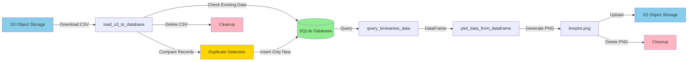

This is a project that illustrated a scenario that a user may face in practice. In this project, one function is responsible for generating data in a interval while another updates a line plot using the matplotlib library.

See **plot_timeseries.py** for more information.  

This is an interesting use case since the data loader is directly specified in the container. Mimicking an already existing pipeline to get data.  

The data loader is responsible for generating data and uploading it to an object storage. The data is then used by the time series plotter to plot the data. It might help to have an aggregation script that runs maybe every midnight to have a single file to load the data. Additionally, you can use a database for example PostgreSQL (Plus since you can make vector databases) or MySQL to improve the application load times.

## Workflow Architecture

The timeseries plot application now uses SQLite for data persistence with incremental loading optimization:



**Key Benefits:**
- **Data Persistence**: Historical data accumulates in SQLite across runs
- **Incremental Loading**: Only new data is inserted, preventing duplicates and speeding up large datasets
- **Reduced S3 Calls**: Local database caching minimizes API requests
- **Query Flexibility**: Easy to add filters, aggregations, and time windows
- **Scalable**: Simple migration path to PostgreSQL or TimescaleDB

**Performance Optimization:**

The `load_s3_to_database` function now performs intelligent duplicate detection:
- Compares incoming data against existing records (x,y pairs)
- Only inserts new data points not already in the database
- Logs statistics: `Inserted N new records (skipped M duplicates)`
- Significantly faster for large datasets with overlapping data

# Setup your digital ocean spaces 

```bash
# export your environment variables
# or add them to your .bashrc or .bash_profile
export digi_ocean_api_key=your_digital_ocean_api_key
export ENDPOINT_URL=https://ams3.digitaloceanspaces.com
export SECRET_KEY=your_secret_key
export SPACES_ID=your_spaces_id
export SPACES_NAME=your_spaces_name
```

# Running the Data Loader locally

```bash
# create a virtual environment
pipenv install

# activate the virtual environment
pipenv shell

# Update packages
pipenv update

# security vurnerabilities
pipenv check

# update lock file
pipenv lock

# run the data loader
python generate_data.py
```

# Seeing the data as its being generated

```python
import pandas as pd
import matplotlib.pyplot as plt
import matplotlib.animation as animation

# Function to read the CSV file and return a DataFrame
def read_csv():
    return pd.read_csv('data.csv')

# Function to update the plot
def update_plot(frame):
    """load data and update plot"""
    data = read_csv()
    plt.cla()
    plt.plot(data['x'], data['y']) 
    plt.xlabel('X')
    plt.ylabel('Y')  
    plt.title('Real-time Data Plot')

# Set up the plot
fig, ax = plt.subplots()

# Call the update_plot function every second
ani = animation.FuncAnimation(fig, update_plot, interval=1000)  # Update every second

# Show the plot
plt.show()
```


# How to build Docker image  

For the generate data script


```bash
docker build -t generate_data:v0 .
```

```bash
docker build -t plot-timeseries-app:v0 .
```

# Reduce the size of the image (Optional/Not tested)
Docker slim is a tool that can be used to reduce the size of the image.  
Learn more about it [here](https://hub.docker.com/r/dslim/docker-slim)

```bash
docker pull dslim/docker-slim:latest
```

```bash
#generate data
docker-slim build --http-probe generate_data:v0
```

```bash
#plot timeseries
docker-slim build --http-probe plot-timeseries-app:v0
```


# How to run the Docker container

Specify shared named docker volume. To store the data somewhere and the other container will have access to it.  

```bash
docker run -e ENDPOINT_URL -e SECRET_KEY -e SPACES_ID -e SPACES_NAME generate_data:v0
```

See if data is being populated in the directory  

```bash
docker exec nameofcontainer tail data/data.csv
```

```bash
docker run -e ENDPOINT_URL -e SECRET_KEY -e SPACES_ID -e SPACES_NAME plot-timeseries-app:v0
```

# Restart Container

```bash
docker start -ia plot-timeseries-app:v0
```

# Expected Output from running docker image or K8s logs name of the pod  

**Dataloader**  
Uploaded data to object storage True  
Checking great data expectations for project  
Uploaded data expectations to object storage True  

**Time series plot**  
loaded data into working directory for now  
made plot saved it in directory for now  
Uploaded data to object storage True  

# Troubleshooting

## Common S3/Database Errors

### Missing Environment Variables
**Error:** `EnvironmentError: Missing required environment variables: ...`

**Solution:** Ensure all required environment variables are set:
```bash
export ENDPOINT_URL=https://ams3.digitaloceanspaces.com
export SECRET_KEY=your_secret_key
export SPACES_ID=your_spaces_id
export SPACES_NAME=your_spaces_name
```

Verify they are set:
```bash
echo $ENDPOINT_URL
echo $SPACES_NAME
```

### S3 Connection Failures
**Error:** `S3 upload/download attempt failed - Code: ...`

**Solutions:**
- Check your internet connection
- Verify your S3 credentials are correct
- Ensure your Digital Ocean Spaces endpoint URL is correct
- Check if the bucket/space name exists and you have access
- The application will automatically retry up to 3 times with exponential backoff

### Database Lock Issues
**Error:** `Database is locked. Another process may be using it`

**Solutions:**
- Ensure no other process is accessing the database file
- Check if another container is running with the same database
- Wait a few seconds and try again
- The application uses a 30-second timeout to handle temporary locks

### Empty CSV File
**Error:** `CSV file is empty` or `CSV file contains no data rows`

**Solutions:**
- Verify the data generation process completed successfully
- Check if the data.csv file was created properly
- Ensure the dataloader container ran to completion before starting the plot container

### File Not Found
**Error:** `File not found: ...` or `FileNotFoundError`

**Solutions:**
- Ensure the file was created by the previous step
- Check file permissions
- Verify the working directory is correct
- For Docker, ensure volumes are mounted correctly

## Retry Behavior

The application includes automatic retry logic for network operations to handle transient failures:

### S3 Operations (Upload/Download)
- **Max Attempts:** 3
- **Retry Strategy:** Exponential backoff
- **Timeouts:** 
  - Connect timeout: 10 seconds
  - Read timeout: 30 seconds
- **Backoff Schedule:**
  - 1st retry: Wait 1 second (2^0)
  - 2nd retry: Wait 2 seconds (2^1)
  - 3rd attempt: Final attempt

### Example Retry Behavior:
```
2025-01-15 10:00:00 - ERROR - S3 upload attempt 1/3 failed - Code: RequestTimeout
2025-01-15 10:00:00 - INFO - Retrying in 1 seconds...
2025-01-15 10:00:01 - ERROR - S3 upload attempt 2/3 failed - Code: RequestTimeout
2025-01-15 10:00:01 - INFO - Retrying in 2 seconds...
2025-01-15 10:00:03 - INFO - Successfully uploaded data.csv to my-space
```

## Cleanup Behavior

### Temporary Files
The application automatically cleans up temporary files to prevent disk space issues:

**Dataloader:**
- Removes expectation test files after uploading to S3
- Restores original working directory on exit

**Timeseries Plot:**
- Removes downloaded CSV files after loading into database
- Removes generated plot PNG files after uploading to S3
- Cleanup occurs even if errors occur (using finally blocks)

### Database Files
Database files (`timeseries_data.db`) persist across runs to maintain historical data. To reset:
```bash
# Remove database file to start fresh
rm timeseries_data.db
```

## Logging Configuration

### Default Logging
Both components use Python's standard logging with INFO level by default:
```python
import logging

logging.basicConfig(
    level=logging.INFO,
    format='%(asctime)s - %(name)s - %(levelname)s - %(message)s'
)
```

### Adjusting Log Level
For more verbose output, set DEBUG level before running:
```bash
# In your Python code
logging.basicConfig(level=logging.DEBUG)
```

Or use environment variable:
```bash
export LOG_LEVEL=DEBUG
python main.py
```

### Log Output Examples

**Successful Run:**
```
2025-01-15 10:00:00 - INFO - Starting data creation process
2025-01-15 10:01:00 - INFO - Uploading data.csv to object storage
2025-01-15 10:01:02 - INFO - Successfully uploaded data.csv to my-space
2025-01-15 10:01:02 - INFO - Cleaned up temporary file: expectation_dataframe_at_columns_2025-01-15_10-00-00
```

**With Retries:**
```
2025-01-15 10:00:00 - ERROR - S3 upload attempt 1/3 failed - Code: ServiceUnavailable, Message: Service temporarily unavailable
2025-01-15 10:00:00 - INFO - Retrying in 1 seconds...
2025-01-15 10:00:01 - INFO - Successfully uploaded data.csv to my-space
```

### Database Operation Logs
```
2025-01-15 10:00:00 - INFO - Database initialized successfully with indexes
2025-01-15 10:00:05 - INFO - Downloading data.csv from S3
2025-01-15 10:00:07 - INFO - Successfully downloaded data.csv from my-space
2025-01-15 10:00:08 - INFO - Inserted 150 new records (skipped 50 duplicates)
2025-01-15 10:00:08 - INFO - Cleaned up downloaded file: data.csv
2025-01-15 10:00:10 - INFO - Successfully queried 200 records from database
```

## Performance Considerations

### Large Datasets
For large CSV files (>10,000 rows), the application uses chunked loading:
- Default chunk size: 10,000 rows
- Reduces memory usage
- Provides progress logging

### Database Indexes
Automatically creates indexes on (x, y) columns for faster duplicate detection.

### Connection Pooling
Uses context managers to ensure proper connection cleanup and prevent connection leaks.  
